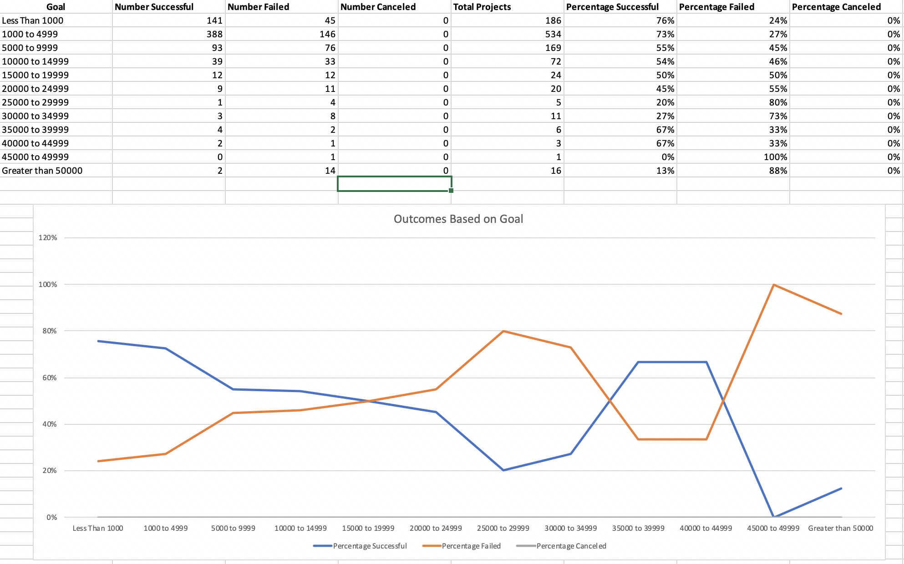
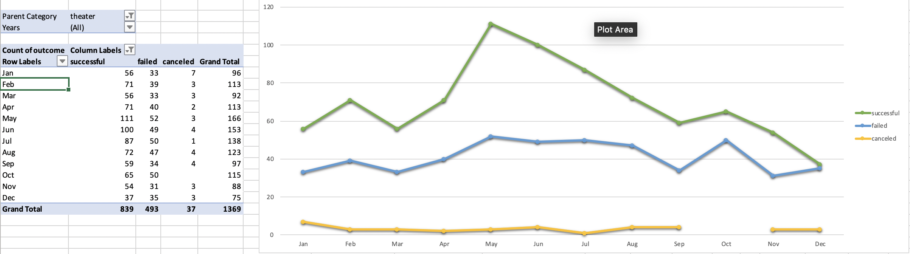

# Challenge Solution Grading Instructions

The objective of this challenge is for learners to practice using Excel functions and visualization capabilities. 

Because this is the first challenge of the course, expect to see submissions of varying organization. Below are the key points to look out for as you work through each assignment. 

## Written Analysis

The written analysis created during this challenge should capture these points: 

1. What was the problem the learner addressed?
2. What steps did the learner take to solve the problem?
3. An explanation of the analysis (including screenshots).

These points should be stored in a README.md document located in the home direcotry of the repo. In addition to the document type, the information must be presented in the form of at least three paragraphs and includes images of the charts created during the challenge.

The goal of the writing assignment is for students to present their findings in a logical manner; grammatical and structural errors are permitted for this challenge.

## Worksheets & PNGs

The final solution is provided to you via the [KickstarterStats_Solved.xlxs](KickstarterStats_Solved.xlxs) file. Use this file as a reference when checking learners' submissions. 

Challenge workbooks should contain two additional sheets: Outcomes based on Goals and Outcomes based on Launch Date.

**Note**: Each submission should already be using filtered data.

**Outcomes Based on Goals**

Once filtered to only include data for the Theater category and Plays subcategory, the submission should resemble the screenshot below.

**Outcomes Based on Launch Date**

The pivot table should be filtered to include only Theater campaign kickstarters and should resemble the screenshot below.

