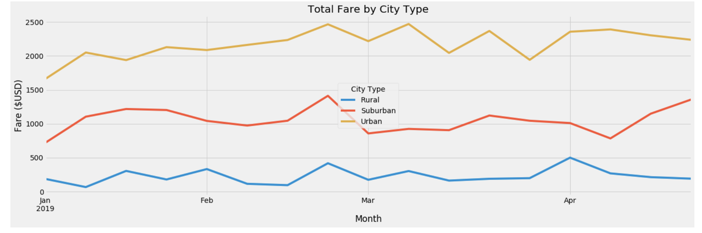

# Challenge Solution Grading Instructions

The objective of this challenge is for learners to sharpen their Python skills and the Pandas and Matplotlib libraries to perform additional exploratory analysis of the ride-sharing data.

For the written analysis, the learners should be familiar with writing and formatting a README.md file with images. There are some writing tips that we have provided in the instructions to guide the learners in helping them with their write analysis.

By now, students should have a good grasp of Python and using Pandas. They will be expected to use three Pandas features, the `pivot()` function, the `loc` attribute, and the `resample()` method, which they haven't encountered in any module activity. Below are the key points to use to guide them.

## Technical Analysis

Make sure they follow the step-by-step instructions. For the new Pandas features, they will need to use the `pivot()` function first, then the `loc` attribute, and finally the `resample()` method.

If they don't make the index the `Date` using the `pivot()` function then they will have difficulties using the `loc` attribute and the `resample()` method.

## Solution File

The final solution is located in the [PyBer Challenge](Pyber_Challenge_Solution.ipynb) file. Use this file as a reference when checking the learner's submission.

Challenge repositories should contain the following:

**A Readme File**

* The README.md file should contain the written analysis.

**A Summary DataFrame**

* The summary DataFrame should have the total rides, total drivers, the total fares, the average fare per ride and the average fare per driver for each city type.

**A Multi-line Graph**

* The multi-line graph should have a line for each city type, that shows the sum of the fares for each week on one graph.

