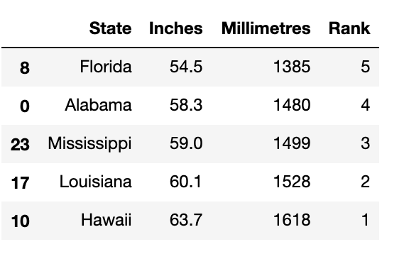
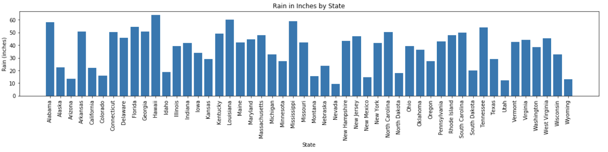

# Unit Assessment: Python

This Unit Assessment allows you to check your knowledge, as well as demonstrate your competency in key concepts from Modules 3 through 6. 

After submitting the assessment, you will see a summary of your performance. While you will not be able to see your performance on individual questions, you are allowed unlimited attempts to complete the assessment.

Some of the questions on this assessment require specific resources. Download the following resources before you get started. 

[cereal.csv](resources/cereal.csv)

[donors2008.csv](resources/donors2008.csv)

[avg_rain_state.csv](resources/avg_rain_state.csv)

[youtube_response.json](resources/youtube_response.json)

**NOTE:** This assessment has questions and answers that are shuffled so they may not be in this order. Correct answers are indicated and bold.

## Question 1

Complete the following code below so that it will do the following tasks: 

1. Open and read the cereal.csv file. 
2. Skip the header row. 
3. Read through each row. 
4. Print out the cereals the following cereals that contain 5 or more grams of fiber in this order:

    ```
    100% Bran
    All-Bran
    All-Bran with Extra Fiber
    Bran Flakes
    Fruit & Fibre Dates; Walnuts; and Oats
    Fruitful Bran
    Post Nat. Raisin Bran
    Raisin Bran
    ```

**Correct Answer Code**

```
import csv
cereal_csv = os.path.join("..", "cereal.csv")

with open(cereal_csv, newline="") as csvfile:
    csvreader = csv.reader(csvfile, delimiter=",")

    csv_header = next(csvfile)

    for row in csvreader:
        if float(row[7]) &gt;= 5:
            print(row[0])
```

## Question 2

You are trying to find which classroom “Dan” is in, i.e., `name = "Dan"`.  You have access to a list of students first names only from three separate classrooms, `classroom_1`, `classroom_2`, and `classroom_3`.  Dan is only in one of the classrooms.  

What is the order of the following code fragments that would check all three classrooms and print out which classroom “Dan” is in.

```1._________________:
   2._______________________ 
3. _________________:
   4.________________________ 
5. ________________:
    6. _____________
```

**Correct Answer**

```
1. if name in classroom_1:
    2. print(f"{name} is in the classroom_1.")
3. elif name in classroom_2:
    4.print(f"{name} is in classroom_2.")
5.else:
    6. print(f"{name} is in classroom_3.")
```

## Question 3

1. Download the _donors2008.csv_.
2. Open and read the _donors2008.csv_ file into a pandas DataFrame.
3. Using groupby, create a Series with the average “Amount” for each state.
4. Convert the Series to a DataFrame if needed.
5. How many states have averages equal to or greater than $750.00?

- 10
- 11
- **9 (Correct Answer)**
- 8

## Question 4

The  following code has a syntax error. Assuming you have a folder named “output” and a file named “employees.txt”. Click on the syntax error.

```
import os
import csv

file_to_save = os.path.join("output", "employees.txt")

with open(file_to_save, "w") as new_file:
    employees = (
        f"First Name', 'Last Name', 'SSN\n"
        f"Caleb', 'Frost', '505-80-2901\n")

    txt_file.write(employees)
```

**Correct Answer:**
**`txt_file.`**

## Question 5

Assuming you have a folder named “output” and a file named “employees.txt”.  What is the correct code that needs to be used to write the data to the file?

```
import os
import csv

file_to_save = os.path.join("output", "employees.txt")

with open(file_to_save, "w") as new_file:
    employees = (
        f"First Name', 'Last Name', 'SSN\n"
        f"Caleb', 'Frost', '505-80-2901\n")

    _______.write(employees)
```

- `file`
- `employees`
- `employees.txt`
- **`new_file` (Correct Answer)**

## Question 6

What Python method is used to get all the keys from a dictionary?

- `get()`
- **`keys()` (Correct Answer)**
- `get_keys()`
- `key()`

## Question 7

What is the output when the following code is run?

```
students = ("Frank", "Mary", "Jasmine", "Ivana", "Ahmed")
students.append("Serena")
print(students)
```

- The code won’t compile.
- `['Frank', 'Mary', 'Jasmine', 'Ivana', 'Ahmed', 'Serena']`
- **`AttributeError: 'tuple' object has no attribute 'append'` (Correct Answer)**
- `('Frank', 'Mary', 'Jasmine', 'Ivana', 'Ahmed', 'Serena')`
- `('Frank', 'Mary', 'Jasmine', 'Ivana', 'Ahmed')`

## Question 8

Using pandas, how would you export a DataFrame, “df” as the file, “data_file.csv” into a folder, “Output” without the index, but with the header? (Select all that apply)

- **`df.to_csv("Output/data_file.csv", index=False)` (Correct Answer 1)**
- `df.to_csv("Output/data_file.csv")`
- `df.to_csv("Output/data_file.csv", header=True)`
- `df.to_csv("Output/data_file.csv", index=False, header=False)`
- `df.to_csv("Output/data_file.csv", header=False)`
- **`df.to_csv("Output/data_file.csv", index=False, header=True)` (Correct Answer 2)**

## Question 9

Download avg_rain_state.csv and read it into a pandas DataFrame as rain_df. 

What is the code that will return the following output.
 



- **`rain_df.sort_values(['Rank'], ascending=False).tail()` (Correct Answer)**

## Question 10

Download _avg_rain_state.csv_. Open and read the file the CSV file into a pandas DataFrame, called “df”.  Using the MATLAB matplotlib method, complete the code to create the following graph. 

**Correct Answer Code Below**

```
x_axis = np.arange(len(df))
tick_locations = [value for value in x_axis]
plt.figure(figsize=(20,3))
plt.bar(x_axis, df["Inches"])
plt.xticks(tick_locations, df["State"], rotation='vertical')
plt.title("Rain in Inches by State")
plt.xlabel("State")
plt.ylabel("Rain (inches)")
plt.show()
```

## Question 11

Open and read the file, _avg_rain_state.csv_ into a Pandas DataFrame and answer the following questions

1. What is the mean rainfall for the entire DataFrame?

- **37.078 (Correct Answer 1)**

2. What is the median rainfall for the entire DataFrame?

- **41.75 (Correct Answer 2)**

3. How many modes are there for rainfall?

- **3 (Correct Answer 3)**

## Question 12

From the following information that creates a pie chart. Drag the best answer for each of the following questions.

```
pies = ["Apple", "Pumpkin", "Chocolate Creme", "Cherry", "Apple Crumb", "Pecan", "Lemon Meringue", "Blueberry", "Key Lime", "Peach"]
pie_votes = [47,37,32,27,25,24,24,21,18,16]
colors = ["yellow","green","lightblue","orange","red","purple","pink","yellowgreen","lightskyblue","lightcoral"]
offset = (0,0,0,0.2,0,0,0,0,0,0)
```

1. What type of pie will be offset in the pie chart?

- **Cherry (Correct Answer 1)**

2. What is the color of the pie wedge that is offset?

- **orange (Correct Answer 2)**

3. What is the percentage of votes for the pie wedge that is offset?

- **10.0 (Correct Answer)**

## Question 13

For the following data. 

```
test_grades = {
    'Class': ['Oct', 'Oct', 'Jan', 'Jan', 'Oct', 'Jan'], 
    'Name': ["Cyndy", "Logan", "Laci", "Elmer", "Crystle", "Emmie"], 
    'Test Score': [90, 59, 72, 88, 98, 60]}
```

1. Create a DataFrame from the “test_grades” dictionary. 
2. Create bins, 0, 59, 69, 79, 89, 100, to hold the data.
3. Assign a letter grade, as “letter_grades”, for the four bins as the labels.

Complete the code that will create a new column “Letter Grade” based on the four bins and labels

**Correct Answer Code Below**

`df['Letter Grade'] = pd.cut(df['Test Score'], bins, labels=letter_grades)`

## Question 14

Using the following code.

```
import requests
url = "https://api.spacexdata.com/v2/launchpads"
```

What is the length of the JSON file after you make the request?

- 3
- **6 (Correct Answer)**
- 1
- `TypeError: object of type 'response' has no len()`

## Question 15

Using the following code.

```
import request
url = "https://api.spacexdata.com/v2/launchpads"
```

Using a for loop, what is the order of the "full name" of each launch site in the JSON file when printed to the output cell?

**Correct Answer Order Below**

1. Vandenberg Air Force Base Space Launch Complex 3W
2. Cape Canaveral Air Force Station Space Launch Complex 40
3. SpaceX South Texas Launch Site
4. Kwajalein Atoll Omelek Island
5. Vandenberg Air Force Base Space Launch Complex 4E
6. Kennedy Space Center Historic Launch Complex 39A

## Question 16

Add the correct exception error so that when the code is run you get the last line to print to the terminal.

**Correct Answer Code Below**

```
try:
    print("Infinity looks like + " + str(10 / 0) + ".")
except ZeroDivisionError:
    try:
        print("I think her name was + " + name + "?")
    except NameError:
        try:
            print("Your name is a nonsense number. Look: " + int("Gabriel"))
        except ValueError:
            print("I made it through the gauntlet. The message survived!")
```

## Question 17

Download youtube_response.json and use the following code to open and read the JSON file. Then answer the following question.

```
import json
import os

filepath = os.path.join("youtube_response.json")
with open(filepath) as jsonfile:
    video_json = json.load(jsonfile)
```

Complete the code that returns the link to the video's thumbnail jpg from the video_json variable.

**Correct Answer Code Below**

`video_json['data']['items'][0]['thumbnail']['default']`

## Question 18

You have converted a CSV file to a DataFrame,“df”. How would you get the names of the columns from the DataFrame?

- `df.headers()`
- `df.head()`
- **`df.columns` (Correct Answer)**
- `df.columns()`

## Question 19

What piece of code defines the beginning of a Python function?

- `function()`
- **`def` (Correct Answer)**
- `define():`
- `def():`

## Question 20

What is the matplotlib function that is used to create box and whisker plots?

- `boxwhisker()`
- **`boxplot()` (Correct Answer)**
- `box() `
- `boxplots()`
