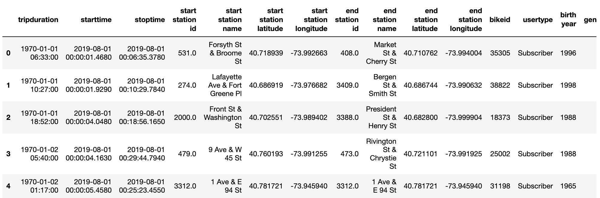

# Challenge Solution Grading Instructions

The objective of this challenge is for learners to perform data engineering on a csv file to change the datetype of a column in order to create time series graphs in Tableau. In addition the learners will create visualizations that show the differences bike checkout times for the type of user and gender throughout the day as a heatmap. Then they'll create a story in Tableau and write a report that describes the key outcomes of the NYC Citibike analysis.

## Deliverable 1: Change Trip Duration to a Datetime Format

For the first deliverable, we are asking the learners to crack open their Pandas and Python skills and knowledge to change the datatype of the "tripduration" column from an integer to datetime. 

The learners should not find the tasks in this challenge to be difficult. However, we have provided [starter code](../Resources/NYC_CitiBike_Challenge_starter_code.ipynb) that they should download into their bikesharing folder, and rename it `NYC_Citibike_Challenge.ipynb`. The starter code, has commented steps in the file where learners will need to add code to complete this part of the challenge.

Some learners will try to convert the datatype in Tableau. This conversion will not create the elapsed time in hours and minutes that is needed for Deliverable 2. Some may try to use the calculated field option but we advise against this because we would like them to practice using their data engineering skills instead. Others might be familiar with using the `astype()` function to change a datatype. However, for this part of the challenge the learners will need to use the `pandas.to_datetime()` function. 

We have provided a GoogleFu tip and a short exercise in the **Hint** callout to help the learners convert an integer to datetime datatype. It is important that they use the right unit of time in the `unit=` parameter. 

After the conversion to a datetime datatype the "tripduration" column is the same as in this image.

## Deliverable 2: Create Visualizations for the Trip Analysis

For the second deliverable, the learners will create five visualizations in Tableau. The first two visualizations will use the datetime datatype for the "tripduration" column to show the length time bikes are checked out for all riders and genders. Then, they'll create heatmaps that show how many trips are taken for all riders and genders by the hour for each day of the week, and display a breakdown by type of user and gender what days of the week a user will checkout a bike. 

The visualizations they'll be creating in this challenge haven't been taught in the module, so they may be a bit challenging. We have provided the steps in the order to create each visualization on Tableau version 2020.2.4.

## Deliverable 3: Create a Story and Report for the Final Presentation

For this deliverable the learners will need to create a Story in Tableau using the five visualizations they create in Deliverable 2 and two visualizations that they created in the module. Then, they'll provide a report in the repository README with all seven visualizations with a summary of each visualization. The report will contain three sections: an overview of the analysis, results, and summary.

**Overview of the analysis:** Explain the purpose of this analysis.

**Results:** Using the visualizations you have in your Tableau Story provide a summary of each visualization underneath the image. 

**Summary:**  Provide a high-level summary of the results and two additional visualizations that you would perform with the given dataset.

The README.md document should be in the home directory of their repository. All links should be working, and images should be formatted and displayed where appropriate.

## Solution Files

We have provided the [datatype conversion solution](../Challenge_Solution/NYC_CitiBike_Challenge.ipynb) and [Tableau challenge solution](../Challenge_Solution/NYC_Citibike_Challenge.twb) as a reference when checking learners' submission. 

## Submission

Make sure they upload the following to their bikesharing GitHub pages repository:

1. The `NYC_Citibike_Challenge.ipynb` file.
2. An updated README.md that has the written analysis with visualizations. Also, embed the Tableau Public link in the README.md file.

## Grading Rubric

The [Tableau Grading Rubric](../Resources/Tableau_Grading_Rubric.pdf) is provided for you to use when grading the learners' submissions.
