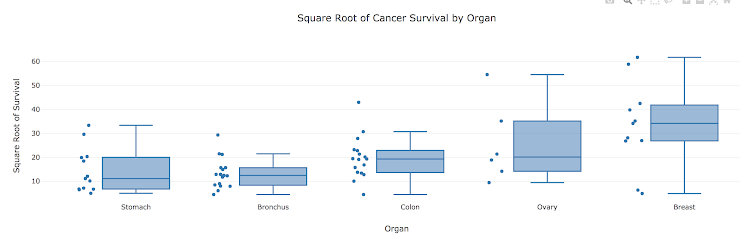

# Unit Assessment: Visualization

You are about to complete the Visualization Unit Assessment! This Unit Assessment allows you to check your knowledge, as well as demonstrate your competency in key concepts from Modules 10 through 14. 

After submitting the assessment, you will see a summary of your performance. While you will not be able to see your performance on individual questions, you are allowed unlimited attempts to complete the assessment.

Some of the questions on this assessment require specific resources which are referenced in those questions.

**NOTE:** Questions on this assessment are in order, however the answers may be shuffled and won't appear in order. Correct answers are indicated and bold.

## Question 1

On a webpage with several `<p>` elements but only one class of “location,” which of the following lines will correctly scrape only that element?

- **`location = BeautifulSoup.find("p", class_="location")` (Correct Answer)**
- `location = BeautifulSoup.find("p", class="location")`
- `location = BeautifulSoup.find("div", class="location")`
- `location = BeautifulSoup.find("p", id="location")`

## Question 2 

Which of the following scenarios would be a good use case for Chrome DevTools?

- To check the responsiveness of a website through different viewports.
- To search for particular HTML elements, tags, or classes for web scraping.
- To look at the properties of each HTML element (such as padding or margin).
- **All of the above. (Correct Answer)**

## Question 3

Of the following options, which line of code has an error?

- `<a href="www.google.com">Click here to search!</a>`
- **`` (Correct Answer)**
- `<div class="col-md-10"></div>`
- `<div class="container"></div>`

## Question 4

What is one of the differences between HTML class and id attributes?

- **`class` should be used when assigning to multiple elements, `id` should be used when assigning to a unique element. (Correct Answer)**
- `id` should be used when assigning to multiple elements, `class` should be used when assigning to a unique element.
- The `id` attribute is for CSS and `class` is for HTML.
- The `class` attribute can only be applied to certain elements and tags, but the `id` attribute can be assigned to anything.

## Question 5

Using the following array, which forLoop will correctly log each animal to the console?

`const zooAnimals = ["Zebra", "Rhino", "Giraffe", "Owl"];`

**Answer Option 1 (Correct Answer):**

```
for (i = 0; i < zooAnimals.length; i++) {
         console.log(zooAnimals[i]);
     }
```

Answer Option 2: 

```
for (i = 0; i < zooAnimals.size; i++) {
         console.log(zooAnimals[i]);
     }
```

Answer Option 3: 

```
for (i = 0; i < zooAnimals; i++) {
         console.log(zooAnimals[i]);
     }
```

Answer Option 4:

```
for i = 0; i < zooAnimals.length ; i++ {
         console.log(zooAnimals[i]);
     }
```

## Question 6

Which of the following is an example of using forEach to iterate through the same zooAnimals array?

- `array.forEach(animal => console.log(animal));`
- `forEach.zooAnimals(animal => console.log(animal));`
- `zooAnimals.forEach(console.log(animal));`
- **`zooAnimals.forEach(animal => console.log(animal));` (Correct Answer)**

## Question 7

Of the following functions, which one will correctly log the second item in an array to the console when called?

Answer Option 1:

```
function printIndex() {
   console.log(array);
}

```

**Answer Option 2 (Correct Answer):**

```
function printIndex(i) {
    console.log(i[1]);
}
```

Answer Option 3:

```
function printIndex(i) {
    console.log(i[2]);
}
```

Answer Option 4:

```
function printIndex(i)
    console.log(i);
```

## Question 8

If the above function was converted to an arrow function, which of the following is the correct syntax?

- **`printIndex = (i) => console.log(i[1]);` (Correct Answer)**
- `printIndex(i) => console.log(i[1]);`
- `printIndex = () => console.log(i[1]);`
- `printIndex = {(i)} => console.log(i[1]);`

## Question 9

The following code, `Plotly.newPlot("a", b, c);` creates the plot below. Which argument, directly or indirectly, refers to the data in the plot?



- `"a"`
- **`b` (Correct Answer)**
- `c`
- None of the above

## Question 10

Given the following array of numbers in javascript

`myArray = [132,3,45,87,22]`

What is the correct way to sort the numbers in ascending order?

- `myArray.sort()`
- **`myArray.sort((a, b) => a - b);` (Correct Answer)**
- `myArray.sort((a, b) => b - a);`
- `myArray.sort(ascending=True)`

## Question 11

You are given a JavaScript array containing 300 numerical values. Without knowing the values the array contains, which functions/attributes combination could you use to get the count of numbers over 180?

- `filter()`, `slice()`
- `sort()`, `filter()`
- `filter()`, `count`
- **`filter()`, `length` (Correct Answer)**

## Question 12

Examine the code below. Which of the following best describes the significance of `selectItem(this.value)`?

`<select id="dropdown" onchange="select(this.value)"></select>`

- **When a dropdown menu item is selected, its value is displayed on the page. (Correct Answer)**
- When a dropdown menu item is selected, its value is instantly transformed on the page.
- When a dropdown menu item is selected, the dropdown menu itself is selected.
- When a dropdown menu item is selected, the dropdown menu itself is selected.

## Question 13

Your boss has asked you to create a new branch called “ES6-testing.” On this branch you will replace the ES5 code with ES6 code for a file named, `logic.js`. Once updated, push the new branch to GitHub.

What is the order of steps to create and add files to the branch using terminal or GitBash?

**Correct Order (Correct Answer)**

1. `git checkout -b ES6-testing`
2. Update logic.js with ES6 javascript.
3. `git add logic.js`
4. `git commit -m "updated logic.js with ES6"`
5. `git push origin ES6-testing`

## Question 14

A week ago you updated a `logic.js` file with ES6 code on a branch called “ES6-testing.”

Since then, the branch has been confirmed ready to be merged into the company's main branch on GitHub.

What are the steps you should follow to properly merge the `ES6-testing` branch into the main branch?

**Correct Order (Correct Answer)**

1. Create a pull request on GitHub to merge into the main branch.
2. Await approval of pull request. 
3. Click "Merge Pull Request" button.
4. Click "Confirm Merge" button
5. Delete the `ES6-testing` branch

## Question 15

Using the following GitHub URL:

[https://raw.githubusercontent.com/OpenDataDE/State-zip-code-GeoJSON/master/ca_california_zip_codes_geo.min.json](https://raw.githubusercontent.com/OpenDataDE/State-zip-code-GeoJSON/master/ca_california_zip_codes_geo.min.json)

What type of Geometry is the GeoJSON data?

- **polygon (Correct Answer)**
- point
- LineString
- MultiPoint

## Question 16

If we access the California zip codes as follows in a `logic.js`:

```
let califZips =
https://raw.githubusercontent.com/OpenDataDE/State-zip-code-GeoJSON/master/ca_california_zip_codes_geo.min.json
```

Complete the code to create a popup marker that displays the zip code when each zip code area is clicked on the map. 

**Completed Code (Correct Answer)**

```
​d3.json(califZips).then(function(data) {
    L.geoJSON(data, {
    onEachFeature: function(feature, layer) {
      layer.bindPopup("Zip code: " + feature.properties.ZCTA5CE10);
        }
    }).addTo(map);
});​
```

## Question 17

What are two primary ways that Tableau connects to the data you provide? 

- Live and pull.
- Connect and extract.
- **Live and extract. (Correct Answer)**
- Connect and pull. 

## Question 18

What are the relationships between stories, dashboards, and worksheets?

- Worksheets are comprised of dashboards and stories. Dashboards are comprised of both worksheets and stories.
- Dashboards are comprised of stories.
- **Stories are comprised of worksheets and dashboards. (Correct Answer)**

## Question 19

Tableau has two types of data fields: dimensions and measures. What are the two types of measures?

**Answer Option 1 (Correct Answer):**

Discrete: Values that are treated as finite. Generally, discrete fields add headers to the view.
Continuous: Field values that are treated as an infinite range. Generally, continuous fields add axes to the view.

Answer Option 2:

Blue: Values that are treated as finite. Generally, discrete fields add headers to the view.
Green: Field values that are treated as an infinite range. Generally, continuous fields add axes to the view.  

Answer Option 3:

Discrete: Field values that are treated as an infinite range. Generally, continuous fields add axes to the view.  
Continuous: Values that are treated as finite. Generally, discrete fields add headers to the view.

Answer Option 4: 

Blue: Values that are treated as infinite. Generally, discrete fields add headers to the view.
Green: Field values that are treated as a finite range. Generally, continuous fields add axes to the view.  

## Question 20

Tableau is a data visualization tool known to be easy to use that does not require much code, however, there is one specific field that allows us to code. What is the name of that field?

- VizQL field.
- **Calculated field. (Correct Answer)**
- Formula field.
- Code field.
