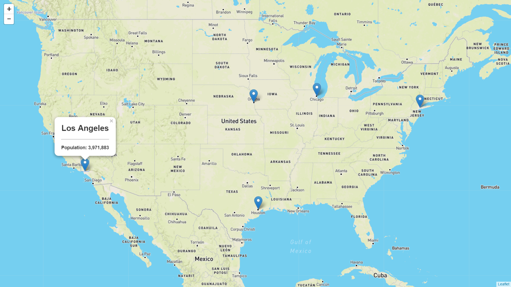
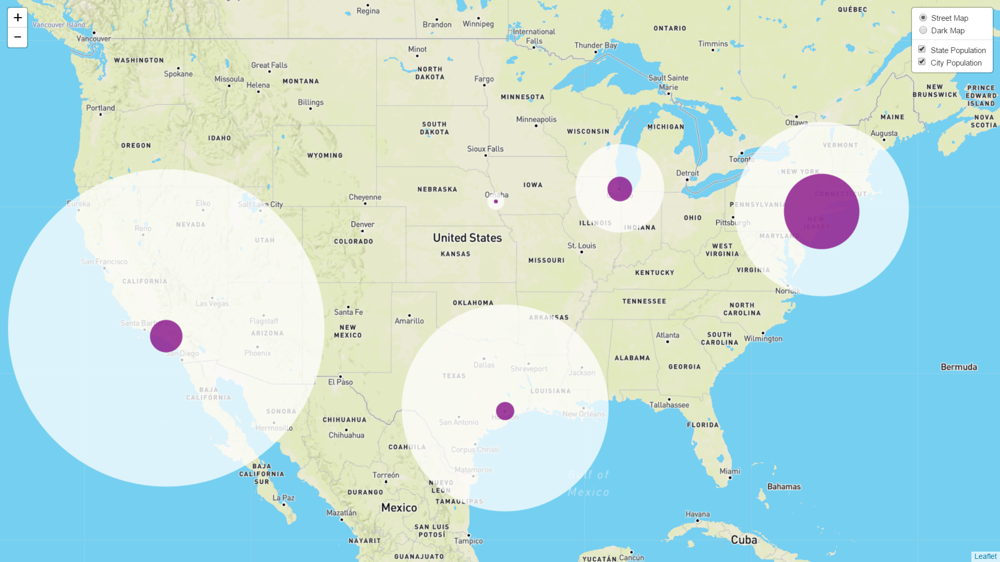
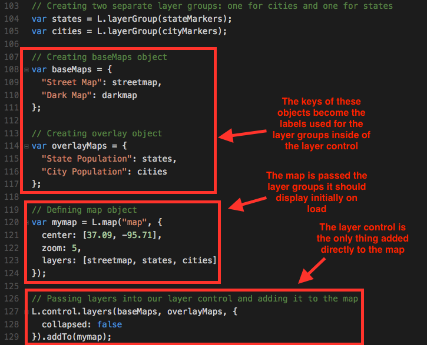

# Module 13: Virtual Class (Required) Lesson Plan

## Overview

Today's Virtual Class (Required) lesson will provide students with refresher activities on Leaflet, Mapbox, and GeoJSON data, finishing with a mini-project to map a dataset of their choosing. 

## Learning Objectives

At the end of the session, learners will be able to:
 
* Create an interactive map with Leaflet
* Use tiles from Mapbox in a Leaflet map
* Create markers, lines, and polygons from GeoJSON data
* Create layer controls
* Create a legend in Leaflet

## Instructor Prep

  
<strong>Career Services</strong>

  Just a reminder that each week students receive a Career Connection in their course of work that ties to what academic content is being consumed. This Career Connection relates this week's material to a professional setting, encourages students to complete certain Career Services tasks, and provides technical interviewing questions, where applicable, that the student can work through.

  Encourage students to work through this material and if you'd like more information on Career Services, please check out the Career Services [resource page](http://bit.ly/DataVizCS) for Data Analytics and Visualization.

- - -

## Class Activities

### Warm-up & Leaflet Markers

| Activity Time: 0:25 | Elapsed Time: 0:25 |
|---------------------|--------------------|

  
<strong> 🎉 Everyone Do: Interview Question Warm-Up (5 mins before class, first 5 mins of class)</strong>

Open the [slideshow](https://docs.google.com/presentation/d/1s5rjJsxHcjKC06HeaqMh4unUA09aoVshsT2Frcv5o5c/edit?usp=sharing) for today's class and begin the weekly presentation with the first slide. The first slide displays an interview question that a student may encounter based on the content of this week's content. 

**This week's question:** What kind of data stories can be told with mapping visualizations?

Allow the question to be on the screen 5 mins prior to the start of class as students join the session. Allow the class 1 minute at the start of class to review, then you will ask for a student to volunteer their answer to the question. Next, offer the answer or a few approaches you would take for answering the question.

**Possible answers to this week's question:**

* Voting results

* Weather data

* Traffic times

* Population density

  
<strong> ✏️ Student Do: City Markers (0:15)</strong>

* In this activity students will be plotting markers for various US Cities using Leaflet.

**Instructions**

1. Find the latitude and longitude for the following US cities:

   1. New York

   2. Los Angeles

   3. Houston

   4. Omaha

   5. Chicago

2. Create a marker for each city with a pop-up that displays that city's name and population. For this activity, you may either look up the population for each city, or make one up.

* **Bonus**

Pop-ups take in a string of HTML. If you finish early, try experimenting with passing in different tags or custom CSS!

* **Hints**

* Don't forget to add the marker to your map after creating it!

  
<strong> ⭐ Review: City Markers (0:05)</strong>

* Go over the solution to the last activity, [Stu_City_Markers_Solved](Activities/01-Stu_City_Markers/Solved), together as a class.

* Make sure to highlight key concepts from this activity and ask students the following:

  1. Why did we use a loop to create the markers?

     * Rather than write code to plot each individual marker manually, we can store our location data inside of an array of objects we loop through to plot them programmatically. Inform students know that the loop isn't required, but it's a little more DRY and organized to do it this way.

  2. What's `bindPopup` for?

     * The `bindPopup` method to attach popups to marker objects. Point out how we can insert HTML and CSS inside of the `bindPopup` method.

  3. What about the `addTo` method? What do we use that for? What argument does it take?

     * Here we're using the `addTo` method to add markers to the map.

       * Scroll back up to where `myMap` is defined to help students understand how all the code ties together.

  4. What two arguments does `L.marker` seem to receive?

     1. The coordinates for the new marker. Even though we're creating markers with a loop in this example, the first argument of the `L.marker` method is still an array of coordinates used to plot the marker

     2. Any other configuration we want to pass the new marker, such as a title, or whether it should be draggable or not.

[Having issues with this section? Report a bug!](https://bit.ly/2WwGgbW)

### More Markers

| Activity Time:  0:15 |  Elapsed Time: 0:40  |
|----------------------|----------------------|

  
<strong> ✏️ Students Do: More Markers (0:10)</strong>

* In this activity students will work with different types of vector layers.

**Instructions**

* Using the files in the [Unsolved](Activities/04-Stu_Other_Markers/Unsolved) folder as a starting point, create the following vector layers and add them to the map:

  * A red circle over the city of Dallas

  * A line connecting NYC to Toronto

  * A polygon that covers the area inside Atlanta, Savannah, Jacksonville and Montgomery

**Hints**

* The [logic.js](Activities/04-Stu_Other_Markers/Unsolved/logic.js) file contains some starter code.

* Use the 'Vector Layers' section of the [Leaflet documentation](http://leafletjs.com/reference-1.0.3.html#toc) for reference.

  
<strong> ⭐ Review: More Markers (0:05)</strong>

* Spend a few minutes answering any questions students might have about the previous activity.

* Make sure students have some understanding of the last activity by asking the following:

  1. What are some of the different types of vector shapes we have available to us? No need to list them all, but important ones to know for now are:

     1. Polyline

     2. Polygon

     3. Rectangle

     4. Circle

  2. What arguments do our vector layers accept when being created?

     1. An array of coordinates describing where our shape should appear

     2. A configuration object describing styles that should be applied to the shape. A complete list of style options for vector shapes can be found in the [Leaflet documentation for path options](http://leafletjs.com/reference-1.0.3.html#path-option) we can use to describe styles for our shape.

[Having issues with this section? Report a bug!](https://bit.ly/2T5MKwb)

### Layers 

| Activity Time:  0:20 |  Elapsed Time: 1:00  |
|----------------------|----------------------|

  
<strong> ✏️ Students Do: Layers (0:15)</strong>

* For this activity, we will return to our US cities map and re-factor the code to use layer groups and a layer control. In so doing, we will be able to represent the population for the entire state as well as the city.

**Instructions**

1. Open the [logic.js](Activities/06-Stu_City_Population_Layers/Unsolved/logic.js) file inside of the Unsolved folder.

2. Add logic to this file to accomplish the following:

   1. Create a layer group for city markers and a separate layer group for state markers. All of the markers have been created for you already and stored in the `cityMarkers` and `stateMarkers` arrays. Store these layer groups in variables named `cities` and `states`.

   2. Create a `baseMaps` object to contain the `streetmap` and `darkmap` tiles, which have been already defined.

   3. Create an `overlayMaps` object to contain "State Population" and "City Population" layers.

   4. Add a `layers` key to the options object inside of the `L.map` method and set its value to an array containing our `streetmap`, `states`, and `cities` layers. These will determine which layers are displayed when the map first loads.

   5. Finally, create a layer control and pass in the `baseMaps` and `overlayMaps` objects. Add the layer control to the map.

**Hints**

* If you get stuck refer to the [Leaflet Layers Control Docs](http://leafletjs.com/examples/layers-control/)

* If successful, you should be able to toggle between Street Map and Dark Map base layers, as well as turn State Population and City Population overlay layers on and off.

  
<strong> ⭐ Review: Layers (0:05)</strong>

(City vs State population data)

* Slack out the [Solved](Activities/06-Stu_City_Population_Layers/Solved) version of the activity and go through it as a class. In particular, make sure to highlight the following:

  1. How we can create layer groups from markers by running the `L.layerGroup` method and passing in an array of layers we want to group.

  2. How we define our base maps and overlay maps by creating objects and passing them into the `L.control.layers` method. This creates labels used to identify the different layers in the layer control.

  3. How we define a `layers` property to our map's configuration and describe the layers we want to be active when the map is loaded.

  

* Congratulate the class for completing this activity. This map allows us to get a quick look at what portion of a state's population lives in its largest city! We can see that, in addition to having the largest population, New York also has the largest percentage of its state's population. Fun Fact: over 40% of New York state's population lives in New York City!

* Answer any other questions students may have about this example.

[Having issues with this section? Report a bug!](https://bit.ly/35X0RJk)

### GeoJSON

| Activity Time:  0:20 |  Elapsed Time: 1:20  |
|----------------------|----------------------|

  
<strong> ✏️ Students Do: GeoJSON (0:15)</strong>

* For this activity students will be working with GeoJSON data to plot occurrences of earthquakes.

**Instructions**

1. Open the [logic.js](Activities/08-Stu_Geo-Json/Unsolved/logic.js) file.

2. Your starter code places an API call to the USGS Earthquake Hazards Program API. Take a moment to study the "features" array that is extracted from the response.

3. Add some logic to create a GeoJSON layer containing all features retrieved from the API call and add it directly to the map. You can reference today's previous activities as well as [Leaflet's Docs for GeoJSON](http://leafletjs.com/examples/geojson/).

4. Create an `overlayMaps` object using the newly created earthquake GeoJSON layer. Pass the `overlayMaps` into the layer control.

**Bonus**

* Create a separate overlay layer for the GeoJSON, as well as a base layer using the `streetmap` tile layer and the `darkmap` tile layer. Add these to a layer control. Refer to the previous activity if stuck here.

* Add a popup to each marker to display the time and location of the earthquake at that location.

**Hints**

* See Leaflet Documentation on GeoJSON:

  * <http://leafletjs.com/reference.html#geojson>
  * <http://leafletjs.com/examples/geojson/>

  
<strong> ⭐ Review: GeoJSON (0:10)</strong>

* When time's up, slack out [Stu_Geo_Json_Solved](Activities/08-Stu_Geo-Json/Solved) and walk students through the solution.

* Make sure they understand the following:

  1. Ask students which method we use to create a GeoJSON layer.

     * We pass **all** of the earthquake feature data into the `L.GeoJSON` method. We save its return value (the new Leaflet GeoJSON layer) to the `earthquakes` variable.

  2. What do they think is happening with the `onEachFeature` function we've defined?

     * `onEachFeature` is a built-in hook Leaflet provides during layer creation. We can define a function to perform some custom functionality with the addition of each feature object to the GeoJSON layer. In our case, we're giving each layer a popover with the time and location of the earthquake.

  3. What are `baseMaps` and `overlayMaps` for? Why not just add the layers directly to the map?

     * We could just add the GeoJSON layer directly to the map. But then we couldn't use a layer control with those layers.

       * After creating our GeoJSON layer, we create a `baseMaps` layer and an `overlayMaps` layer in the same way as in the previous activity. In this case, we're using earthquakes instead of cities for our overlay layer.

* Be sure to answer any further questions.

[Having issues with this section? Report a bug!](https://bit.ly/2T5YRcx)

- - -

### Break

| Break Time: 0:05  | Elapsed Time: 1:25 |
|-------------------|--------------------|

- - -

### Mapping Mini-Project

| Activity Time:  0:35 |  Elapsed Time: 2:00  |
|----------------------|----------------------|

  
<strong> ✏️ Students Do: Mapping Mini-Project (0:25)</strong>

For the remainder of the session, students will work on a mini-project.

Have students work in small groups, creating breakout rooms after students have received instructions. They will create a map of their very own from scratch. They will find a dataset, map it, then use a new plugin to visualize the data in an interesting way.

Here are some GeoJSON datasets if students need help finding data:

* [Citibike](https://gbfs.citibikenyc.com/gbfs/en/station_information.json)

* [Global Flight Position Data](https://snowflakesoftware.com/news/geojson-now-available-on-laminar-data/)

* [ZIP Code Boundaries](https://github.com/OpenDataDE/State-zip-code-GeoJSON)

* [US State, County, and Nation outlines](https://eric.clst.org/tech/usgeojson/)

* [Data.gov GeoJSON Search](https://catalog.data.gov/dataset?res_format=GeoJSON)

Tell them that they will share their map with the class and give a VERY brief presentation on it at the end of the session.

The focus of this assignment is on getting a working map, however, so also let them know that the presentations are wholly secondary to making something cool.

  
<strong> 🎉 Everyone Do: Mini-Presentations on Maps (0:10)</strong>

Close the breakout rooms and call on groups one at a time. Have a student in the group share their screen and present their newest map to the class. Have them explain how they made the map in basic detail and answer whatever questions that may come up during the presentations.

### End Class
