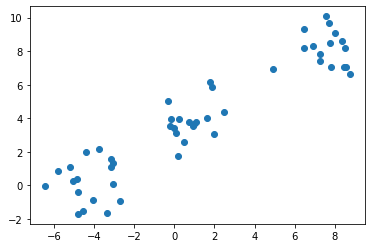
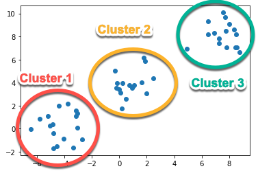
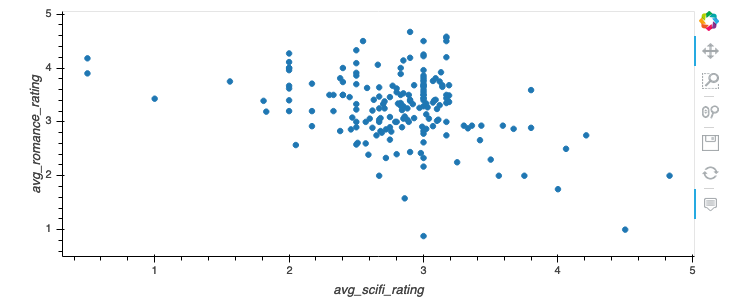
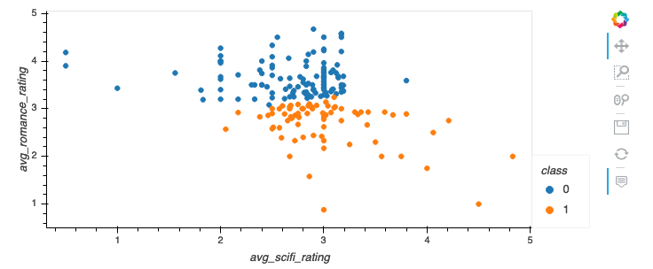
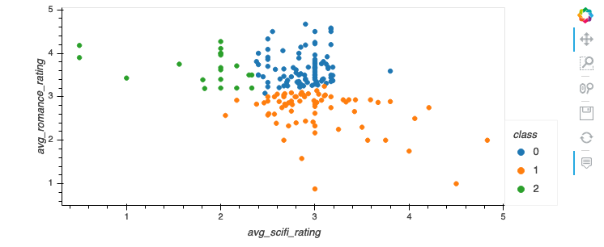
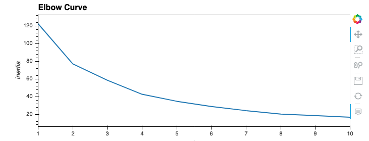
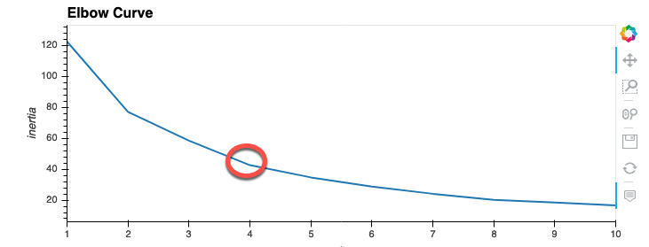
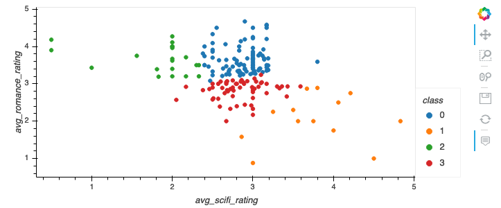
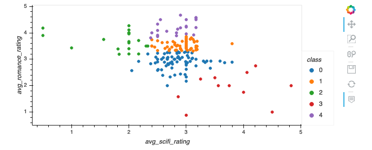

# Module 18: Virtual Class (Recommended) Lesson Plan (2hr)

## Overview

Today's Virtual Class (Recommended) Session is an optional session to reinforce knowledge. We will use this session as an opportunity to dive deeper into concepts that may have been confusing for students the first time they learned them.

## Learning Objectives

At the end of the session, learners will:

* Understand the basics of Unsupervised learning
* Understand the differences of Supervised and Unsupervised Learning.
* Understand what clustering is.
* Use the k-means algorithm to cluster a dataset.
* Understand the Elbow curve and how it can aid in determing clusters.

- - -

# Class Activities

## 1. Warm Up & Temperature Check

| Activity Time: 0:10 | Elapsed Time: 0:10 |
|---------------------|--------------------|

<details>
  <summary><strong> 📣 Instructor Do: Install your tools (5 mins)</strong></summary>

* Explain to the class that before running any of the next exercises be sure the class has installed the proper libraries. Some libraries may have been installed previously or if students have started the async material. To make sure everyone is on the same page install the following packages into the student's environment:

  * **Scitkit-learn:** `conda install scikit-learn`

  * **Plotly:** `conda install plotly`

  * **hvPlot:** `conda install -c pyviz hvplot`

* Once everything has been installed the rest of the exercises can be completed.

  </details>

<details>
  <summary><strong> 📣 Instructor Do: Temperature Check (5 mins)</strong></summary>

Using the [Zoom Polling](https://support.zoom.us/hc/en-us/articles/213756303-Polling-for-Meetings) feature or a [Poll Everywhere](http://www.polleverywhere.com), launch a poll of the class to identify areas that they would like to review from the week's asynchronous content.

**Poll Text:**

*Select all of the topics you feel comfortable with from this week's lesson:*

* Unsupervised learning
* Unsupervised vs. Supervised
* Clustering
* K-means algorithm
* Elbow chart

Based on the results of the poll, consider adjusting the amount of time spent on individual activities and/or consider skipping activities if the class feels comfortable with a topic.

</details>

## Instructor Demos

| Activity Time:       1:00 |  Elapsed Time:      1:15  |
|---------------------------|---------------------------|

<details>
  <summary><strong> 📣 1. Instructor Do: Introduction to Unsupervised Learning (15 mins)</strong></summary>

* Explain to students that in general terms, machine learning has two main areas of application: supervised and unsupervised learning.

* Explain to students that unsupervised learning:

  * Deals with unlabeled input data.
  * Only uses input data.
  * Has the goal of determining patterns or grouping data.

* Compare unsupervised learning to supervised by explaining:

  * Supervised use labeled input data as unsupervised learning takes unlabeled data.
  * Supervised uses training datasets where as unsupervised takes only input data.
  * Supervised learning's goal is to predict a class or value where unsupervised determines patterns or groups of data.

* Explain that unsupervised learning does come with some challenges:

  * Since the data isn't labeled we don't know if the output is correct.
  * An expert would be needed to determine is the results are meaningful.

* Even with the challenges in unsupervised learning can be very useful for things like grouping customer spending habits or finding fraudulent credit card charges.

  </details>

<details>
  <summary><strong> 📣 2. Instructor Do: Clustering (10 mins)</strong></summary>

* One of the more popular uses for unsupervised learning is through a clustering algorithm. Clustering is grouping data together so that every member of that group is similar in a way.

* Display the following image to the class:



* Explain that the data points fall into to distinct groups or clusters. We can assume that points in each cluster are similar.

  * We can see three distinct groups of data points on the chart, or clusters.

  * Each cluster contains data points that are more similar to their respective clusters and different to points on other clusters.



  </details>

<details>
  <summary><strong> 📣 3. Instructor Do: Intro to K-means clustering (20 mins)</strong></summary>

* Explain that clustering isn't as easy as just viewing the data and determining the the amount of clusters. There has to be a way to mathematically determine the clusters.

* Explain the k-means algorithm is the most common and simple algorithm used to group data points into clusters. K-means takes a predetermine amount of clusters to make and assigning each data point to one of those clusters.

* The k-means algorithm works by performing two steps:

  * Assigns points to the closest cluster center.
  * Then re-adjusts the cluster's center by setting each center as the mean of all the data points contained within that cluster.

* Let's take a look at an example where the clusters aren't so obvious using a dataset of the average ratings to two genres of movies: romance and sci-fi.

* Say you are trying to group people together based on how they rate movies so you can recommend additional movies for them to watch.

  * Start by loading in you dependencies then reading in the `genre_ratings` data set.

  ```python
  import pandas as pd
  import plotly.express as px
  import hvplot.pandas
  from sklearn.cluster import KMeans

  genre_df = pd.read_csv("resources/cleaned_genre_ratings.csv")
  genre_df.head()
  ```

  * Next plot the data on a scatter chart to see what the spread of data looks like.

  ```python
  # Scatter plot of data
  genre_df.hvplot.scatter(x="avg_scifi_rating", y="avg_romance_rating")
  ```

  

  * As can see the clusters aren't so obvious. K-means will be used to break the data into cluster. We'll start with two clusters.

  ```python
  # Set the kmeans model
  model = KMeans(n_clusters=2, random_state=3)
  model
  ```

  * Once our model has been created we will fit the data to the model.

  ```python
  # Fit the model
  model.fit(genre_df)
  ```

  * Then we'll have the model create the predictions for which cluster each data will belong to.

  ```python
  # Make predictions
  predictions = model.predict(genre_df)
  print(predictions)
  ```

  * We will create a class column that will contain the labels in our DataFrame.

  ```python
  # Add a class column with the labels
  genre_df['class'] = model.labels_
  genre_df.head()
  ```

  * Now lets plot the results only this time we are factoring in the class that k-means assigned the data points to.

  ```python
  genre_df.hvplot.scatter(x="avg_scifi_rating", y="avg_romance_rating", by="class")
  ```

  

* Explain the following:

  * With two groups it looks like there is a group that favors romance movies and a group that doesn't favor romance movies. Does this really give us enough information about tastes?

* Repeat the process using 3 clusters and display the result.

  

* Now with three groups we can see the following:

  * A group that favor romance but not sci-fi.
  * A group that favors romance but is indifferent to sci-fi.
  * A group that doesn't favor romance but favors sci-fi a bit more.

* With more clusters we can fine tune each groups taste in movies. If we keep going adding more clusters each group will be more refined. When is too many clusters too much? How do we know the ideal amount? These questions will be answered using the a method called the elbow curve.

  </details>

<details>
  <summary><strong> 📣 4. Instructor Do: Elbow Curve (15 mins)</strong></summary>

* Since k-means needs to have the amount of clusters given ahead of time how can you be sure the amount of clusters you chose is correct.

* One method for doing so is to use something called and elbow curve.

  * The elbow curves plots the amount of clusters, x, vs. an objective function called inertia.
  * Inertia involves some complicated math, but is basically a measure of the amount of variation in a dataset.

* Let's return to our movies example and see what this would look like.

  * Start by importing dependencies and reading in the data set.

  ```python
  # Initial imports
  import pandas as pd
  from sklearn.cluster import KMeans
  import plotly.express as px
  import hvplot.pandas

  genre_df = pd.read_csv("resources/genre_ratings.csv")
  genre_df.head()
  ```

  * Next we create an empty list to store inertia values and a list of k values to test. Then loop through the values running the K-means algorithm on each value for k and appending the inertia to our lists.

  ```python
  # Create and store inertia values
  inertia = []
  k = list(range(1, 11))

  for i in k:
      km = KMeans(n_clusters=i, random_state=0)
      km.fit(genre_df)
      inertia.append(km.inertia_)
  ```

  * Finally we plot the elbow curve to get the results chart.

  ```python
  # Define a DataFrame to plot the Elbow Curve using hvPlot
  elbow_data = {"k": k, "inertia": inertia}
  df_elbow = pd.DataFrame(elbow_data)
  df_elbow.hvplot.line(x="k", y="inertia", title="Elbow Curve", xticks=k)
  ```

  

* On the chart you can see a change in steepness between two x values, more so than other two points, this is considered the elbow of the chart. Here that point is at 4.

  

* The value for x where we find this "elbow" gives us a good indication for what how many clusters should be used.

* Run the k-means algorithm with 4 clusters and display the results chart.



* **Note** that there also could be an elbow at 5, which could also be correct. Let's see what the chart looks like with 5 clusters.



* The elbow curve is not a definite answer for how many clusters there should be, rather works as a guide. Ultimately it will be up to the data professional to determine the right amount.

  </details>

<sub>[Having issues with this section? Report a bug!](https://bit.ly/2Bcl6HN)</sub>

- - -

## 3. Office Hours

The rest of a Virtual Class (Recommended) Session is reserved for open-ended office hours, driven by students. Encourage participation by reminding them that this is their time to ask questions and get assistance from their instructional staff as they’re learning new concepts, so they should take full advantage of the time.

Expect that students may ask for assistance such as the following:

* Further review on a particular subject
* Debugging assistance
* Help with computer issues
* Guidance with a particular tool